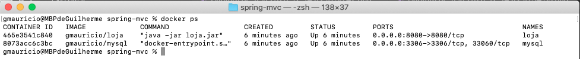

# Especificações

- Docker
- Java 8
- Spring Boot
- Spring Data
- Spring MVC
- String Security
- Thymeleaf
- Bootstrap
- MySQL 8
- Vue.js
- Axios

#### Baixar o projeto utilizando o git:
 ``` 
    git clone https://github.com/gmauriciobr/vue-axios.git
 ```

 1. Executar o comando para fazer o build e aguardar a execução:
    ``` 
       docker-compose build 
    ```

 2. Depois de executado o comando anterior, executar o seguinte:
    ``` 
       docker-compose up -d 
    ```
 3. Para verificar se o processo ocorreu tudo certo, e se a aplicação subiu, rodar o seguindo comando:
    ```
       docker-compose ps
    ```
   Esperando o seguinte resultado:
   

4. Acessar pelo navegador a ULR: http:\\localhost:8080/home
   - 
   - 


